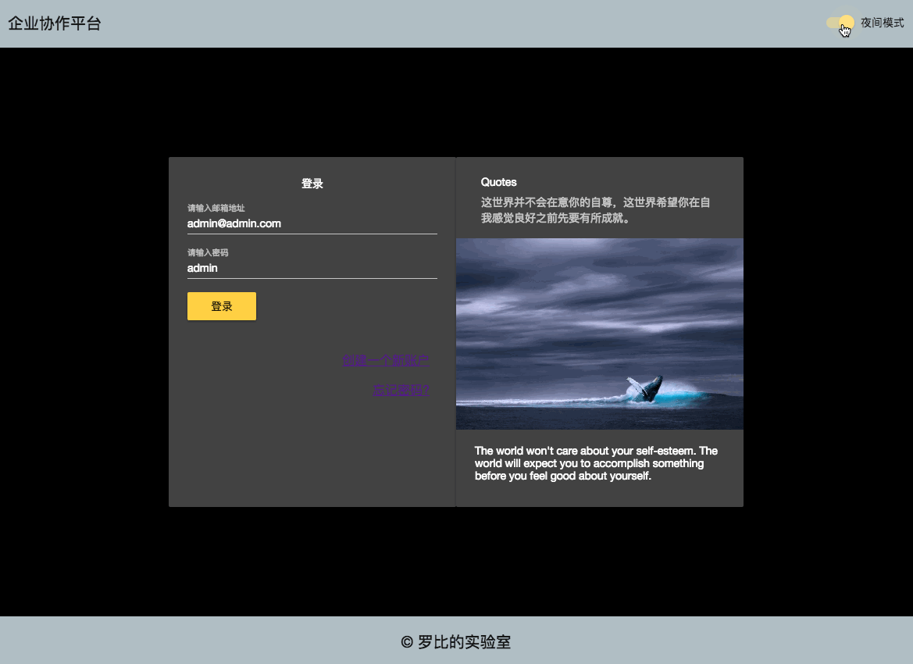
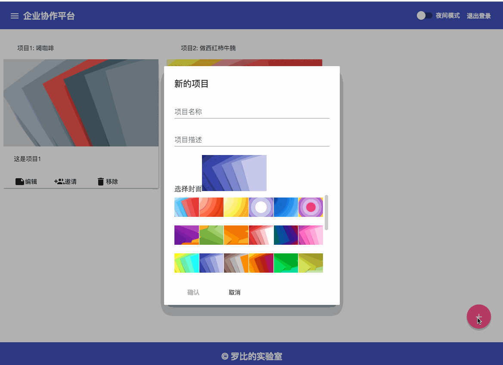

# 任务管理平台 - Task Manager

This project was generated with [Angular CLI](https://github.com/angular/angular-cli) version 6.0.0.

## Demo

### 登录/注册页


### 项目/任务页


## 运行
```
  yarn        # 安装dependencies
  yarn start  # 启动, 访问localhost:4200
```
## 技术实现
  + Angular + RxJS + Redux
  + 使用RxJS完成事件&异步请求的处理
  + 在Angular中引入Redux对各模块进行状态管理, 将组件和业务逻辑分离, 在actions -> effects -> reducers过程中, 组件仅发送action及接收store确定UI状态, effects完成信号拼接及service调用, reducer完成state更新

## 项目结构
```
.
├── actions     # 各模块Actions
│   ├── auth.action.ts
│   ├── project.action.ts
│   ├── quote.action.ts
│   ├── router.action.ts
│   ├── task-list.action.ts
│   ├── task.action.ts
│   └── user.action.ts
├── anims       # 自定义动画
│   ├── card.anim.ts
│   ├── item.anim.ts
│   ├── list.anim.ts
│   └── router.anim.ts
├── app-routing.module.ts
├── app.component.html
├── app.component.scss
├── app.component.spec.ts
├── app.component.ts
├── app.module.ts
├── core        # 加载一次的Core Module
│   ├── core.module.ts
│   ├── footer
│   │   ├── footer.component.html
│   │   ├── footer.component.scss
│   │   └── footer.component.ts
│   ├── header
│   │   ├── header.component.html
│   │   ├── header.component.scss
│   │   └── header.component.ts
│   └── sidebar
│       ├── sidebar.component.html
│       ├── sidebar.component.scss
│       └── sidebar.component.ts
├── directive   # 自定义指令
│   ├── directive.module.ts
│   ├── drag-drop
│   │   ├── drag.directive.ts
│   │   └── drop.directive.ts
│   └── drag-drop.service.ts
├── domain      # 数据模型
│   ├── auth.model.ts
│   ├── err.model.ts
│   ├── index.ts
│   ├── project.model.ts
│   ├── quote.model.ts
│   ├── task-list.model.ts
│   ├── task.model.ts
│   └── user.model.ts
├── effects     # Side effects
│   ├── auth.effects.spec.ts
│   ├── auth.effects.ts
│   ├── index.ts
│   ├── project.effects.ts
│   ├── quote.effects.ts
│   ├── router.effects.ts
│   ├── task-list.effects.ts
│   ├── task.effects.ts
│   └── user.effects.ts
├── login       # 登录/注册页面
│   ├── login
│   │   ├── login.component.html
│   │   ├── login.component.scss
│   │   └── login.component.ts
│   ├── login-routing.module.ts
│   ├── login.module.ts
│   └── register
│       ├── register.component.html
│       ├── register.component.scss
│       └── register.component.ts
├── my-calendar # 日历页面
│   ├── calendar-home
│   │   └── calendar-home.component.ts
│   ├── my-calendar-routing.module.ts
│   └── my-calendar.module.ts
├── project     # 项目页面
│   ├── invite
│   │   ├── invite.component.html
│   │   ├── invite.component.scss
│   │   └── invite.component.ts
│   ├── new-project
│   │   ├── new-project.component.html
│   │   ├── new-project.component.scss
│   │   └── new-project.component.ts
│   ├── project-item
│   │   ├── project-item.component.html
│   │   ├── project-item.component.scss
│   │   └── project-item.component.ts
│   ├── project-list
│   │   ├── project-list.component.html
│   │   ├── project-list.component.scss
│   │   └── project-list.component.ts
│   ├── project-routing.module.ts
│   └── project.module.ts
├── reducers
│   ├── auth.reducer.spec.ts
│   ├── auth.reducer.ts
│   ├── index.ts
│   ├── project.reducer.ts
│   ├── quote.reducer.ts
│   ├── task-list.reducer.ts
│   ├── task.reducer.ts
│   └── user.reducer.ts
├── services
│   ├── auth-guard.service.ts
│   ├── auth.service.spec.ts
│   ├── auth.service.ts
│   ├── project.service.ts
│   ├── quote.services.ts
│   ├── services.module.ts
│   ├── task-list.service.ts
│   ├── task.service.ts
│   └── user.service.ts
├── shared      # 共享的组件
│   ├── age-input
│   │   ├── age-input.component.html
│   │   ├── age-input.component.scss
│   │   └── age-input.component.ts
│   ├── area-list
│   │   ├── area-list.component.html
│   │   ├── area-list.component.scss
│   │   └── area-list.component.ts
│   ├── chips-list
│   │   ├── chips-list.component.html
│   │   ├── chips-list.component.scss
│   │   └── chips-list.component.ts
│   ├── confirm-dialog
│   │   └── confirm-dialog.component.ts
│   ├── identity-input
│   │   ├── identity-input.component.html
│   │   ├── identity-input.component.scss
│   │   └── identity-input.component.ts
│   ├── image-list-select
│   │   ├── image-list-select.component.html
│   │   ├── image-list-select.component.scss
│   │   └── image-list-select.component.ts
│   └── shared.module.ts
├── task        # 任务列表页面
│   ├── copy-task
│   │   ├── copy-task.component.html
│   │   ├── copy-task.component.scss
│   │   └── copy-task.component.ts
│   ├── new-task
│   │   ├── new-task.component.html
│   │   ├── new-task.component.scss
│   │   └── new-task.component.ts
│   ├── new-task-list
│   │   ├── new-task-list.component.html
│   │   ├── new-task-list.component.scss
│   │   └── new-task-list.component.ts
│   ├── quick-task
│   │   ├── quick-task.component.html
│   │   ├── quick-task.component.scss
│   │   └── quick-task.component.ts
│   ├── task-header
│   │   ├── task-header.component.html
│   │   ├── task-header.component.scss
│   │   └── task-header.component.ts
│   ├── task-home
│   │   ├── task-home.component.html
│   │   ├── task-home.component.scss
│   │   └── task-home.component.ts
│   ├── task-item
│   │   ├── task-item.component.html
│   │   ├── task-item.component.scss
│   │   └── task-item.component.ts
│   ├── task-list
│   │   ├── task-list.component.html
│   │   ├── task-list.component.scss
│   │   └── task-list.component.ts
│   ├── task-routing.module.ts
│   └── task.module.ts
└── utils       # 一些工具函数
    ├── area.data.ts
    ├── area.util.ts
    ├── date.util.ts
    ├── debug.util.ts
    ├── identity.data.ts
    ├── identity.util.ts
    ├── reducer.util.ts
    ├── svg.utils.ts
    ├── type.util.ts
    └── user.model.ts
```


